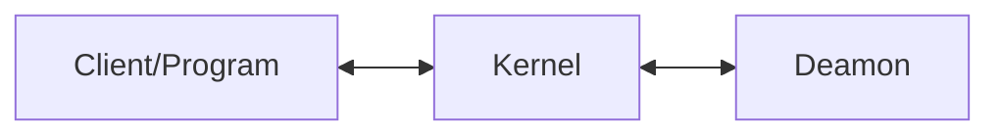
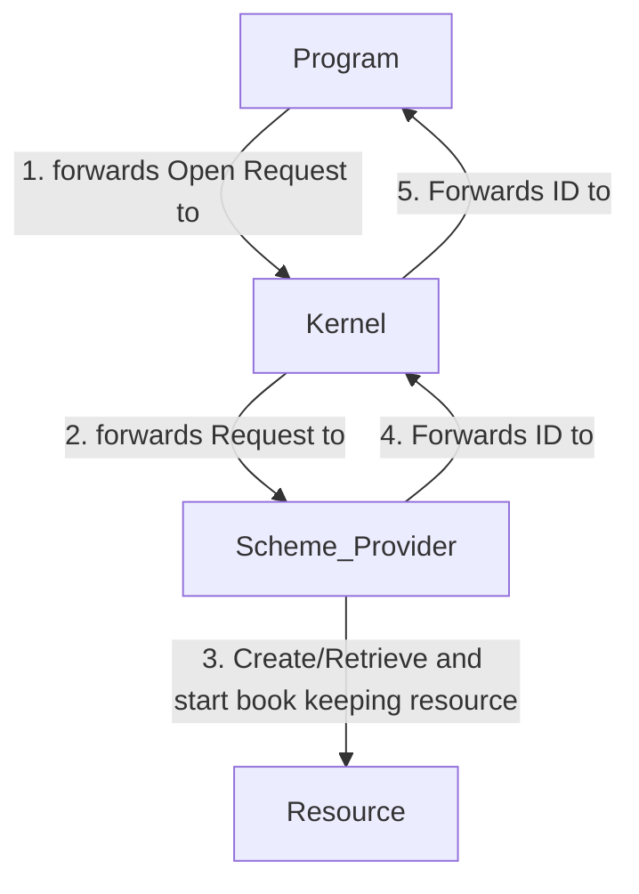
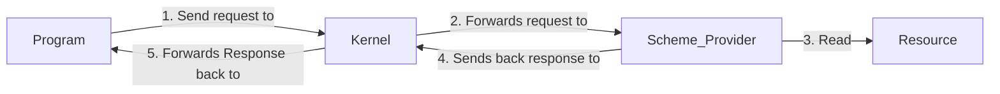

# What is Ion Shell

- Is the default shell in Redox Os
- Runs on Linux too
- Has its own scripting language 

---

# Ion shell works on types instead of just text

Primitives

- Str
- Bool
- Int
- Float

<br>
<hr>
<br>

Collections

<br>

- Arrays
- Maps

---

# Example of Ion Shell code

```sh
echo $filename("/parent/filename.ext")
# Output: 
# filename

for data in @split("person, age, some data" ", ")
    echo $data
end
# Output: 
# person
# age
# some data

fn square x:int
    echo $(( x * x ))
end

let number = 3
square $number
# Output: 
# 9
square a
# Output: 
# ion: function argument has invalid type: expected int, found value 'a'
```

---

# A few parts of my contribution to Ion Shell

- Fixed errors in parser 
- Implemented new built in subst method
- Implemented "pipefail" option

```sh{1|2|3-4|6|8|10|all}
let empty = []
let seq = @subst(  @empty [2 4])
# Output: 2 4
echo $seq

set -p -e

false | true

echo "should not print this"
```

---

# Purpose of schemes in Redox Os

<br>

Used for IPC, Inter Process Communication
  
<br>
  
- Sharing resources
- Provides Services to programs
- Allows organization of resources in any data structure

<br>

<div v-click >

<hr>
<br>

Kernel is the bridge between client and the scheme daemon 

<br>



</div>

---

# Terms for schemes in Redox Os

Terms to clarify

- [ ]  URL
- [ ]  Scheme 
- [ ]  Reference
- [ ]  Scheme Provider

---

# What is an URL in context of scheme

<div v-click class="text-xl p-4">

We are not talking about that kind of URL !

<br/>

<a>https://developer.mozilla.org/en-US/docs/Learn/Common_questions/Web_mechanics/What_is_a_URL</a>

<br/>

<hr>

</div>

<div v-click class="text-xl p-4">

We are talking about this kind of URL

<br/>  

file:/some_path/some_folder

<br/>  

<hr>

</div>

<div v-click class="text-xl p-4">

URL is the path to a resource in a scheme

</div>

---

# Scheme: What is an URL in RedoxOs

Terms to clarify

- [x]  URL
- [ ]  Scheme 
- [ ]  Reference
- [ ]  Scheme Provider

---

# Scheme: Components of an URL in RedoxOs

<br>

**URL** = \<scheme\>:\<reference\>

<br>

- **Scheme:**
  
  Name of scheme. Kind of the resource

<br>

- **Reference:**
  
  Pointer to a resource in a scheme

<br>

<hr>

<br>

Example: 

<br>

file:/some_path/some_folder 

---

# Terms for schemes in RedoxOs

Terms to clarify

- [x]  URL
- [x]  Scheme 
- [x]  Reference
- [ ]  Scheme Provider

---

# What are scheme providers 

Some daemons which respond to requests for resources in scheme

|  Name    | Daemon  | Discription         |
|----------|---------|---------------------|
| ...      | ...     | ...                 |
| disk:    | ahcid   | Raw access to disks |
| file:    | redoxfs | Root filesystem     |
| orbital: | orbital | Windowing system    |
| ...      | ...     | ...                 |

---
layout: center
---

# Client and Daemon (Scheme Provider)

## Opening Resource



---
layout: center
---

# Reading from a resource

A request and response has the returned ID from the opened resource



---

# Terms for schemes in RedoxOs

Terms to clarify

- [x]  URL
- [x]  Scheme 
- [x]  Reference
- [x]  Scheme Provider

---

# Register a scheme with Root Scheme

- Root scheme is an empty String
- Reference after "**:**" is the name of the scheme to register

```rust{2|4-5}
fn main() {
    let mut scheme = VecScheme::new();

    let mut handler = File::create(":vec")
        .expect("Failed to create the vec scheme");
}
```

---

# Implementing a scheme

```rust
struct VecScheme {
    vec: Vec<u8>,
}

impl SchemeMut for VecScheme {
    fn open(&mut self, path: &str, _flags: usize, _uid: u32, _gid: u32) -> Result<usize> {
      // ...
    }
    
    fn read(&mut self, _id: usize, buf: &mut [u8]) -> Result<usize> {
      // ...
    }

    fn write(&mut self, _id: usize, buf: &[u8]) -> Result<usize> {
      // ...
    }
}
```

---

# Processing a request as scheme provider

```rust{8-10|12-13|15-16|all}
fn main() {
  // ... code register slide
  
  // Struct which contains data from request and for later response
  let mut packet = Packet::default();

  loop {
      // Wait for the kernel to send us requests
      let read_bytes = handler.read(&mut packet)
          .expect("vec: failed to read event from vec scheme handler");

      // calls certain function like read if client wants to read resources for example
      scheme.handle(&mut packet);

      handler.write(&packet)
          .expect("vec: failed to write response to vec scheme handler");
  }
}
```

---

# Client using a scheme

```rust{2-3|5-6|8-10|all}
fn main() {
    let mut vec_file = File::open("vec:/hi")
        .expect("Failed to open vec file");

    vec_file.write(b" Hello")
        .expect("Failed to write to vec:");

    let mut read_into = String::new();
    vec_file.read_to_string(&mut read_into)
        .expect("Failed to read from vec:");

    println!("{}", read_into); 
}
```
---

