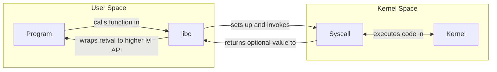

# The `relibc` C Standard Library

(and it's role in the RedoxOS ecosystem)

---
layout: default
hideInToc: true
---

# Table of contents

<Toc />

---

# C standard library (`libc`)

- Provides basic functions, types, macros
- Handles platform-specific implementation details 
  - *so there's work to be done on a new platform*
- There is an ISO standard
- There are multiple implementations (glibc, llvm-libc, musl, …)

<br>

E.g. `<stdio.h>, <stdlib.h>, <string.h>,…`

<br>

`…<math.h>, <threads.h> (since C11)`

<style>
p {
    font-size: 24px;
}
</style>

---

# POSIX

- Standard for Operating Systems
- One part: Exposing a C API
  - Therefor: Superset of ISO C
  - often implemented inside `libc`

<br>

E.g. `unistd.h, dirent.h, fcntl.h, pwd.h, …`[^201]

<br>

[^201]: https://web.archive.org/web/20100724201155/http://www.space.unibe.ch/comp_doc/c_manual/C/FUNCTIONS/funcref.htm

<style>
p {
    font-size: 24px;
}
</style>

---

# `relibc`: C standard library for RedoxOS (and Linux), written in Rust

- Compatibility layer for C software (there are many)
- Written in Rust => C bindings generated automatically w/ `cbindgen`
  - Rust gets you type+memory safety => **best of both worlds**
- Maps operations to syscalls *- difference between Redox and Linux*

---

# Syscalls

- "Kernel API"
- kernel functions a program can call
- run in priviledged mode
- special call syntax
  - that's why libc hides them away
- *On x86 - and many other platforms - implemented as interrupts*

---
hideInToc: true
---

# Syscalls




---

# Syscall example
```rust{1|all|8}
// relibc/src/header/stdio/mod.rs

pub unsafe extern "C" fn fclose(stream: *mut FILE) -> c_int {
    let stream = &mut *stream;
    flockfile(stream);

    let mut r = stream.flush().is_err();
    let close = Sys::close(*stream.file) < 0;
    r = r || close;

    if stream.flags & constants::F_PERM == 0 {
        // Not one of stdin, stdout or stderr
        let mut stream = Box::from_raw(stream);
        // Reference files aren't closed on drop, so pretend to be a reference
        stream.file.reference = true;
    } else {
        funlockfile(stream);
    }

    r as c_int
}
```

---

# Syscall in Redox

```rust{1|all|4}
// src/platform/redox/mod.rs

    fn close(fd: c_int) -> c_int {
        e(syscall::close(fd as usize)) as c_int
    }
``` 

```rust{1|all|5}
// syscall/src/call.rs

    /// Close a file
    pub fn close(fd: usize) -> Result<usize> {
        unsafe { syscall1(SYS_CLOSE, fd) }
    }
```

```rust{1|all|7}
// syscall/src/number.rs

[…]
    pub const SYS_RMDIR: usize =    SYS_CLASS_PATH | 84;
    pub const SYS_UNLINK: usize =   SYS_CLASS_PATH | 10;

    pub const SYS_CLOSE: usize =      SYS_CLASS_FILE | 6;
    pub const SYS_DUP: usize =        SYS_CLASS_FILE | SYS_RET_FILE | 41;
    pub const SYS_DUP2: usize =       SYS_CLASS_FILE | SYS_RET_FILE | 63;
[…]
```

---
hideInToc: true
---

# Syscall in Redox

```rust{1|all}
// kernel/src/syscall/fs.rs

    pub fn close(fd: FileHandle) -> Result<usize> {
        let file = {
            let contexts = context::contexts();
            let context_lock = contexts.current().ok_or(Error::new(ESRCH))?;
            let context = context_lock.read();
            context.remove_file(fd).ok_or(Error::new(EBADF))?
        };

        file.close()
    }
```

---

# Syscall in Linux

```rust{1|all|4}
// relibc/src/platform/linux/mod.rs

fn close(fildes: c_int) -> c_int {
    e(unsafe { syscall!(CLOSE, fildes) }) as c_int
}
```

```rust{1|all|6}
// syscall.rs/src/platform/linux-x86_64/nr.rs

[…]
pub const CLONE: usize = 56;
pub const CLONE3: usize = 435;
pub const CLOSE: usize = 3;
pub const CLOSE_RANGE: usize = 436;
pub const CONNECT: usize = 42;
[…]
```

---
hideInToc: true
---

# Syscall in Linux

```c{1|3-7|8|9-20|all}
// linux/fs/open.c

/*
 * Careful here! We test whether the file pointer is NULL before
 * releasing the fd. This ensures that one clone task can't release
 * an fd while another clone is opening it.
 */
SYSCALL_DEFINE1(close, unsigned int, fd)
{
	int retval = close_fd(fd);

	/* can't restart close syscall because file table entry was cleared */
	if (unlikely(retval == -ERESTARTSYS ||
		     retval == -ERESTARTNOINTR ||
		     retval == -ERESTARTNOHAND ||
		     retval == -ERESTART_RESTARTBLOCK))
		retval = -EINTR;

	return retval;
}
```

<br>

**BONUS:** https://gitlab.redox-os.org/redox-os/syscall/-/blob/master/src/arch/x86_64.rs

---

# `relibc`: tests

```javascript
test('Expect math to work', () => {
  expect(doSomeMath(1, 1)).toBe(2);
});
```

<v-clicks depth=2>

- why are tests important?
  - POSIX / ISO C standard dicate very specific behavior
  - when your `libc` diverges, tons of programs start to misbehave
  - (obv. don't trust the devs)

</v-clicks>

---
hideInToc: true
---

# `relibc`: tests

<br>


---
hideInToc: true
---

# `relibc`: tests

<br>


---
hideInToc: true
---

# `relibc`: tests

<br>


---
hideInToc: true
---

# `relibc`: tests

<br>


---
hideInToc: true
---

# `relibc`: tests

<br>


<style>
    img {
        opacity: 1;
    }
</style>

---

<br>

**...**

<style>
    div p {
        font-size: 160px;
    }
</style>

---
hideInToc: true
---

# `relibc`: tests

<br>


<style>
    p img {
    }
</style>

---

# What would a better test collection for `system()` be?

- Test shell detection on `command == NULL`
- Test blocking `SIGCHLD` and ignoring `SIGINT` and `SIGQUIT`
- Test start-with-hyphen bug
- …
- Test `system()` inhibiting `fork()` SIGCHLD?

---

# What are my long term goals?

- Extending the test suite
- Implement some kind of fuzzing
- Port existing test suites
- *MAYBE: Memory safety in classic non-checking c functions like gets, strcmp… via communication with the allocator*